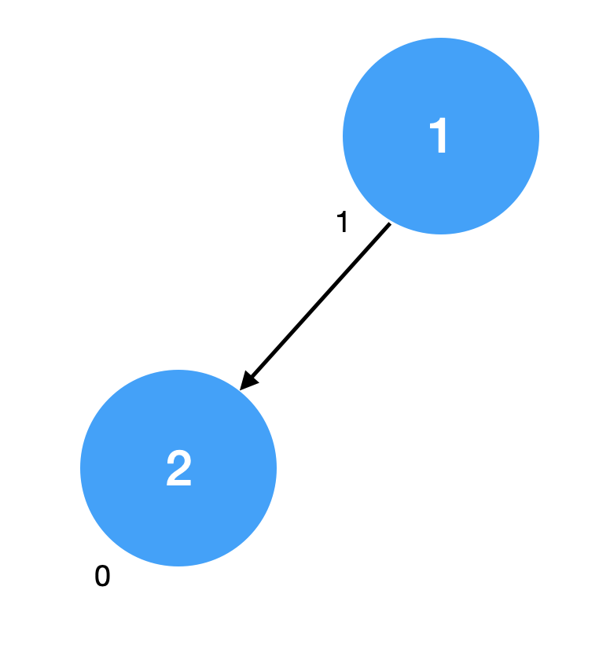
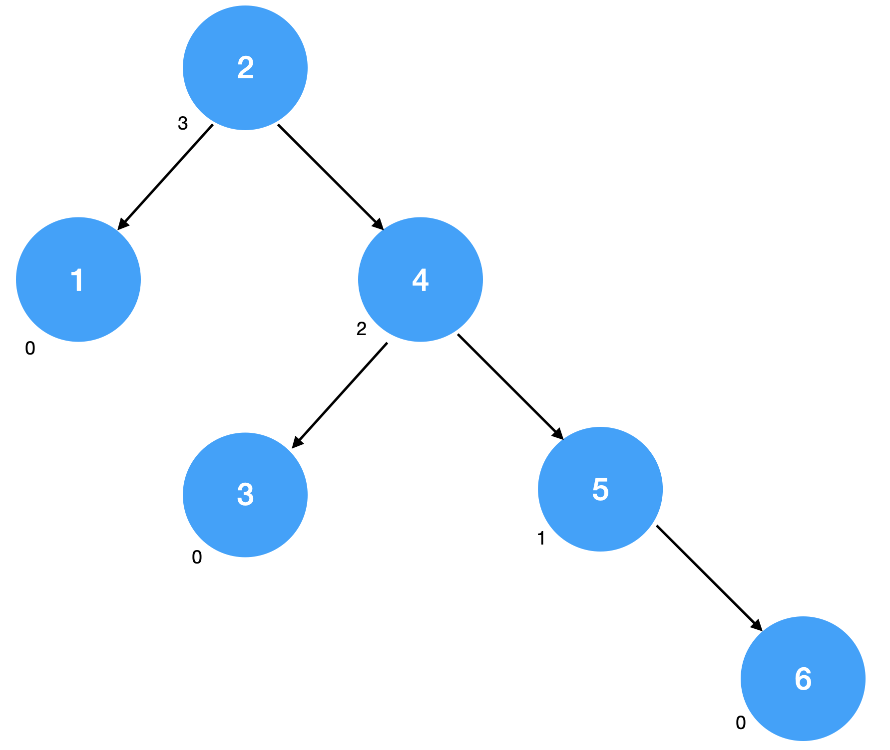

# Verify AVL

## The assignment
Write Java code for an Θ(n) worst-case algorithm that verifies that a tree is actually an AVL tree in `./src/verifyAvl.java`.

You may assume the nodes of the tree have the following definition given in `./src/AVLNode.java`:
```
class AVLNode {
    int key;
    V value;
    int height;
    AVLNode left;
    AVLNode right;
}
```
You must verify the BST Property, the AVL Balance Condition, and the correctness of the height information. If it fails *any* of these properties, return `false`. Otherwise, return `true`. Feel free to add private methods as you see fit.

## Grading
We will be running an autograder with many hidden test cases to grade your submission. You will receive points for each test case you pass. The points will be weighted more heavily on our stress tests, so note that the majority of the points you can get require that your code works without question.

## Testing
We've given you a testing harness in `./test/VerifyAvlTests`. It reads in `./tests.json` and tests your verifyAvl method on the given tree.

The `./tests.json` file contains as many test cases as you wish to add, where each case is on a separate line with the following format:
  {"tree": [5,1,[2,0,null,null], [6,0,null,null]], "answer": true}

Note that the array representation of an AVLNode is as follows:
[int key, int height, [AVLNode left], [AVLNode right]]

So the example above is of a tree with a root node with key 5, a left child node with a key 2, and a right child node with a key 6.

We have provided you with 4 basic test cases:
- A correct AVL tree: [5,1,[2,0,null,null], [6,0,null,null]]

- A tree that violates the BST property: [1,1,[2,0,null,null],null]

- A tree with incorrect height labels: [2,1,[1,0,null,null],[4,1,[3,0,null,null],null]]

- A tree that violates the AVL balance property: [2,3,[1,0,null,null],[4,2,[3,0,null,null],[5,1,null,[6,0,null,null]]]]


**Note: You should add as many test cases as you need to convince yourself that your solution works. Think about edge cases! Your tests will not be graded, but if your code does not work, testing will help you find the problems before we grade it.** 